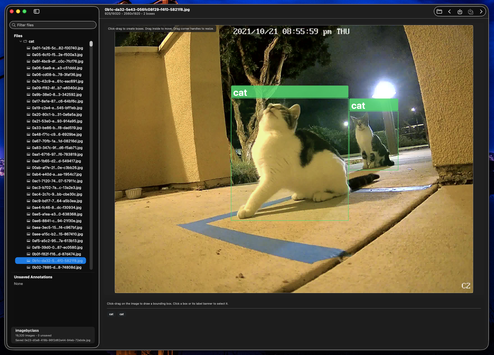

# Image Annotation Tool

`Image Annotation Tool` is a macOS app for bounding-box image annotation with Pascal VOC XML as the source of truth and YOLO export as derived output.

# License

This project continues under the MIT License. See `LICENSE` for full terms.

# Overview



# Current functionality:

- Recursive directory scanning for `.jpg`, `.jpeg`, `.png`
- Collapsible file tree sidebar (collapsed by default)
- Interactive AppKit-backed annotation canvas (draw/select/move/resize boxes)
- Separate overlay label banner for box names (not part of recorded box geometry)
- Pascal VOC XML read/write
- YOLO `.txt` export generation
- Root-level `classes.txt` management with deterministic class IDs
- Unsaved annotations tracking and save-all
- Keyboard shortcuts for open/save/navigation
- Undo/redo for annotation edits
- Scan progress and error/warning reporting for malformed XML/unreadable images

# Keyboard Shortcuts / Keyboard Behavior

## App-level shortcuts

- `Cmd+O` : Open Directory
- `Cmd+S` : Save current image annotations (`.xml`, `.txt`, `classes.txt`)
- `Cmd+Shift+S` : Save all unsaved annotations
- `Cmd+D` : Delete the selected bounding box/object (works even while editing the selected box label field)
- `Space` : Save current image, then move to next image (only advances if save succeeds)
- `Left Arrow` : Previous image (no save)
- `Right Arrow` : Next image (no save)

## Canvas / box editing keyboard behavior (focus-sensitive)

- `Enter` (canvas focused, no box selected): select the first object and focus its label editor
- `Enter` (canvas focused, box selected): open/focus the selected box label editor
- `Delete` / `Backspace` (canvas focused, box selected): delete the selected box (same as the `Delete` button)
- `Cmd+D` (annotation window focused, box selected): delete the selected box, even if the selected-box label text field is currently being edited

## Selected box label editor (bottom inspector text field)

- `Enter` : Apply the edited label, close the selected-box editor (clear selection), and return focus to the canvas
- `Apply` button : Same behavior as `Enter`
- `Cmd+D` : Delete the selected box/object (does not delete selected text; deletes the object instead)
- `Tab` :
  - If there are 2+ objects: apply the current label edit, then move to/select/focus the next object label editor
  - If there is 1 object or no objects: does nothing


# Credits

- Maintainer: David P. Discher
- Large parts of this app were developed with OpenAI Codex (Codex app).
    - that's a slight understatement, GPT-5.3-Codex, Extra High reasoning, and used about 9% of weekly credits of the $20/mo "plus" level. A human never actually looked at or wrote any of this code.

# Post Application build

I went ahead and ask Codex to sum up everything that we did, as the initial MD prompt files, didn't include the iterations I did interactively.  I did not review or test these prompts.

```
OK, take [001-Inital Requirements.md](VibeCodingPrompts/001-Inital Requirements.md)  and [002-implement-stage-001.md](VibeCodingPrompts/002-implement-stage-001.md)  ... and all the feed back I gave you in this thread, and create files prefixing the names with 101 and 102 ... (and so on as needed)  in the VibeCodingPrompts,  "final AI requirements and prompts" or something like that, in as many stages as you want, that, if someone from a blank directory and new GPT-5.3-codex session could use to replicate this application with a high precentage change in one-shot.  It doesn't have to be prefect, doesn't need to be tested, and only create new files in the VibeCodingPrompts directory, don't modify anything else.
```


# QA / Validation

- Manual checklist: `QA/Manual-QA-Checklist.md`
- Stage 005 local validation script: `./Tests/run-stage005-validation.sh`
